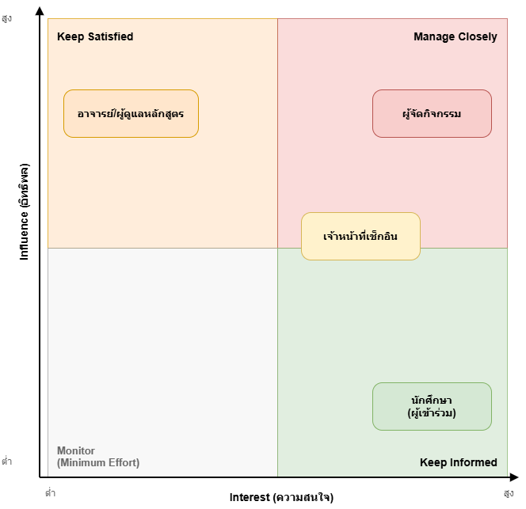
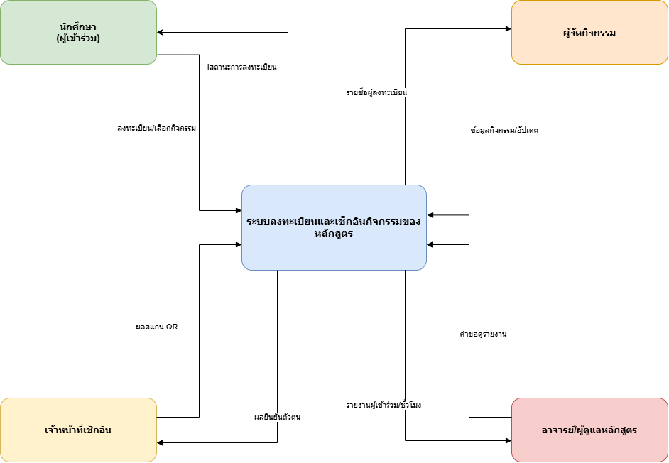

# 02 — Stakeholder, System Context and Scope

> **Week 2 deliverable**  
> เวอร์ชัน: v0.1 | สถานะ: Draft | วันที่ปรับปรุง: 07/08/2026

## 1. Stakeholder Map

| Stakeholder | Category | Needs / Goals | Influence | Engagement Approach |
|---|---|---|---|---|
| นักศึกษา (ผู้เข้าร่วม) | Primary user | ลงทะเบียนและตรวจสอบสิทธิ์เข้าร่วมได้ง่าย | สูง | interview |
| ผู้จัดกิจกรรม | Primary user | กำหนดที่นั่ง/สื่อสารรายละเอียด/ดูรายงานสรุป | สูง | interview |
| เจ้าหน้าที่เช็กอิน | Primary user | เช็กอินได้รวดเร็ว ลดการปลอมแปลงตัวตน | ปานกลาง | observation |
| อาจารย์/ผู้ดูแลหลักสูตร | Secondary user / ผู้ตัดสินใจ | ได้รายงานผู้เข้าร่วม/ชั่วโมงกิจกรรมที่ตรวจสอบได้ | สูง | interview / review |

> Source diagram: [`diagrams/context/w02-stakeholder-map.drawio`](../diagrams/context/w02-stakeholder-map.drawio)

## 2. System Context

ระบบลงทะเบียนและเช็กอินกิจกรรมของหลักสูตรอยู่ตรงกลาง โดยมีผู้ใช้ 4 กลุ่มโต้ตอบโดยตรง ไม่มีการเชื่อมต่อกับระบบภายนอกของมหาวิทยาลัย (เช่น ระบบทะเบียนนักศึกษาจริงหรือบัตรนักศึกษาจริง) ในระยะนี้ ตาม Constraint ของ Case Card ที่ระบุว่า "ใช้ QR/รหัสจำลอง ไม่เชื่อมบัตรนักศึกษาจริง"

**ข้อมูลเข้า-ออกของแต่ละ actor:**

| Actor | ข้อมูลที่ส่งเข้าระบบ | ข้อมูลที่ระบบส่งกลับ |
|---|---|---|
| นักศึกษา (ผู้เข้าร่วม) | ข้อมูลลงทะเบียน (ชื่อ, รหัสนักศึกษาจำลอง, กิจกรรมที่เลือก) | สถานะการลงทะเบียน, QR/รหัสจำลองสำหรับเช็กอิน, การแจ้งเตือนเปลี่ยนแปลงเวลา/สถานที่ |
| ผู้จัดกิจกรรม | ข้อมูลกิจกรรม (ชื่อ, วันเวลา, สถานที่, จำนวนที่นั่ง), การอัปเดตเปลี่ยนแปลง | รายชื่อผู้ลงทะเบียน/รายชื่อสำรอง, รายงานสรุปหลังกิจกรรม |
| เจ้าหน้าที่เช็กอิน | ผลการสแกน/ตรวจสอบ QR หน้างาน | ผลยืนยันตัวตน (ถูกต้อง/ไม่ถูกต้อง/ซ้ำ) |
| อาจารย์/ผู้ดูแลหลักสูตร | คำขอดูรายงาน | รายงานผู้เข้าร่วมและชั่วโมงกิจกรรม |

> Source diagram: [`diagrams/context/w02-system-context.drawio`](../diagrams/context/w02-system-context.drawio)

## 3. Scope Statement

### In Scope

| Area | Included capability | Rationale |
|---|---|---|
| การลงทะเบียน | เปิด/ปิดรับลงทะเบียนกิจกรรมของหลักสูตร (เริ่มจาก 1 กิจกรรม/หลักสูตรเดียว) | แก้ปัญหาการลงทะเบียนซ้ำซ้อนจากแบบฟอร์มกระดาษ (PP-01) |
| การยืนยันสิทธิ์ | ยืนยันสิทธิ์ผู้ลงทะเบียน รวมจัดการรายชื่อสำรองเมื่อที่นั่งเต็ม | รองรับ Fact ที่นั่งจำกัด (F-01) และลดความไม่แน่ใจของนักศึกษา (PP-01) |
| การเช็กอิน | เช็กอินผู้เข้าร่วมด้วย QR/รหัสจำลอง ณ วันจัดกิจกรรม | แทนที่การเซ็นชื่อกระดาษ ลดคิวและการปลอมแปลง (PP-02) |
| การรายงานผล | สรุปรายชื่อ/สถิติผู้เข้าร่วมและชั่วโมงกิจกรรมหลังกิจกรรมจบ | ลดภาระรวบรวมข้อมูลด้วยมือของผู้จัด/อาจารย์ (PP-03) |

### Out of Scope

| Area | Excluded capability | Reason |
|---|---|---|
| ปฏิทินกิจกรรม | ระบบปฏิทินมหาวิทยาลัยเต็มรูปแบบ | Case Card กำหนดขอบเขตเฉพาะกิจกรรมของหลักสูตรเดียว ไม่ใช่ปฏิทินรวมทั้งมหาวิทยาลัย |
| การสะสมกิจกรรม | ระบบสะสมกิจกรรมข้ามคณะ/ข้ามหลักสูตร | Case Card กำหนดให้เริ่มจากกิจกรรมเดียว/หลักสูตรเดียวก่อน |
| การยืนยันตัวตนขั้นสูง | การยืนยันด้วยลายนิ้วมือ/ใบหน้า หรือเชื่อมกับบัตรนักศึกษาจริง | Case Card กำหนดให้ใช้ QR/รหัสจำลองเท่านั้น เพื่อความเป็นส่วนตัว |

## 4. Constraints and Business Rules

| ID | Constraint / Rule | Source | Impact |
|---|---|---|---|
| BR-01 | [Constraint] ต้องใช้ QR/รหัสจำลองสำหรับเช็กอิน ห้ามเชื่อมกับบัตรนักศึกษาจริง | Case Card (Constraint) | จำกัดวิธียืนยันตัวตน ต้องออกแบบ QR/รหัสเฉพาะกิจกรรมแทนการเชื่อมระบบจริง |
| BR-02 | [Constraint] ระยะแรกรองรับกิจกรรมของหลักสูตรเดียว ครั้งละ 1 กิจกรรม | Case Card (Constraint) | จำกัดขอบเขตการออกแบบ ยังไม่ต้องรองรับหลายกิจกรรมพร้อมกัน |
| BR-03 | [Business Rule] ถ้าผู้เข้าร่วมไม่อยู่ครบเวลาตามเงื่อนไขกิจกรรม จะไม่นับชั่วโมงกิจกรรมให้ | Fact F-03 | ระบบต้องบันทึกเวลาเช็กอิน (และอาจต้องมีเช็กเอาท์) เพื่อคำนวณเงื่อนไขนี้ |
| BR-04 | [Business Rule] เมื่อจำนวนลงทะเบียนถึงที่นั่งสูงสุด ผู้ลงทะเบียนถัดไปถูกเก็บเป็นรายชื่อสำรองอัตโนมัติ | Fact F-01 | ระบบต้องมีสถานะ "ตัวจริง/สำรอง" และกลไกเลื่อนคิว (ผู้อนุมัติยังไม่ยืนยัน — ดู OQ-01) |
| BR-05 | [Business Rule] เมื่อผู้จัดกิจกรรมประกาศเปลี่ยนเวลา/สถานที่ ระบบต้องแจ้งเตือนผู้ลงทะเบียนทุกคนที่เกี่ยวข้อง | Fact F-04 | ต้องมีกลไกแจ้งเตือน/notification เมื่อข้อมูลกิจกรรมเปลี่ยน |

## 5. Ethics, Privacy and Accessibility Considerations

- **ข้อมูลส่วนบุคคลที่ระบบอาจเกี่ยวข้อง:** ชื่อ-นามสกุล, รหัสนักศึกษา, สถานะการลงทะเบียน/เช็กอิน — ไม่เก็บข้อมูลอ่อนไหว เช่น เลขบัตรประชาชนหรือข้อมูลสุขภาพ
- **ความเสี่ยงด้านสิทธิ์การเข้าถึง/ความปลอดภัย:** ต้องจำกัดไม่ให้ผู้ใช้เห็นข้อมูลส่วนตัวของผู้อื่น (เชื่อมกับ NFR Privacy) และต้องป้องกันการเช็กอินแทนกันด้วย QR/รหัสที่ทำซ้ำได้ยาก (เชื่อมกับ PP-02, NFR Security)
- **การเข้าถึงสำหรับผู้ใช้หลากหลายกลุ่ม:** ต้องมีวิธีเช็กอินสำรองสำหรับผู้ที่ไม่มีสมาร์ตโฟน/ลืมโทรศัพท์ (ตามเหตุการณ์จำลองใน Case Card, เชื่อมกับ A-02/OQ-05) และหน้าจอต้องอ่านง่ายสำหรับผู้ใช้ครั้งแรกโดยไม่ต้องมีคู่มือ (NFR Usability)
- **ข้อควรระวังด้านจริยธรรม:** ห้ามใช้ข้อมูลบุคคลจริงหรือภาพที่เห็นใบหน้า/ข้อมูลส่วนตัวจริงตลอดโครงงาน (ตาม Case Card) และไม่ควรเปิดเผยรายชื่อผู้ไม่มาร่วมกิจกรรม (no-show) ต่อสาธารณะ เพราะกระทบสิทธิ์ส่วนบุคคล

## 6. Baseline Scope Decision

หลัง Week 2 ทีมตกลงใช้ขอบเขตต่อไปนี้เป็น baseline สำหรับพัฒนาต่อใน SRS (Week 5-8):

- **In Scope:** เปิด/ปิดลงทะเบียน, ยืนยันสิทธิ์ (รวมจัดการรายชื่อสำรอง), เช็กอินด้วย QR/รหัสจำลอง, สรุปรายงานผู้เข้าร่วม/ชั่วโมงกิจกรรม — ครอบคลุม 1 กิจกรรมของหลักสูตรเดียวในระยะแรก ตามที่กำหนดไว้ในข้อ 3
- **Out of Scope:** ปฏิทินมหาวิทยาลัยเต็มรูปแบบ, ระบบสะสมกิจกรรมข้ามคณะ, การยืนยันตัวตนขั้นสูง (ลายนิ้วมือ/ใบหน้า/บัตรนักศึกษาจริง)
- **Business Rules ที่ยืนยันแล้ว 5 ข้อ** (BR-01–BR-05 ในข้อ 4) จะถูกนำไปแปลงเป็น requirement โดยละเอียดในขั้นตอนเขียน SRS
- **Open Questions ที่ยังค้างอยู่** (OQ-01–OQ-05 จาก Problem Brief) จะใช้ออกแบบคำถามสัมภาษณ์ใน Week 3-4 ก่อนสรุปเป็น requirement final

การตัดสินใจนี้บันทึกไว้ที่ [project-management/decision-log.md](../project-management/decision-log.md) (D-01)
