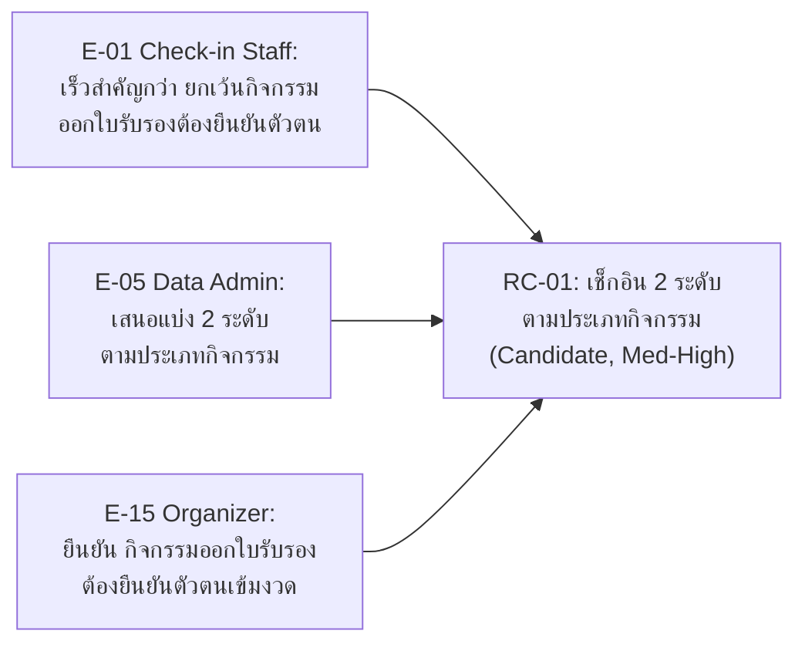

# 04 — Evidence, Conflict, Negotiation and Requirement Candidates

> Week 04 | **AI role output is simulation evidence, not an approved real-world fact.**

## 1. Evidence Tags

`CF` case fact · `SN` simulated need · `CT` constraint/rule · `OP` opinion · `AS` assumption · `PS` proposed solution · `OQ` open question

**กติกาการให้ confidence ต่อ tag** (กันไม่ให้ให้คะแนนความน่าเชื่อถือตามใจ):

| Tag | Confidence สูงสุดที่ให้ได้ | เหตุผล |
|---|---|---|
| `CF` | High | มาจาก Case Card ที่อาจารย์ยืนยันแล้ว |
| `CT` | Med-High ถ้า role มีอำนาจจริงในบทบาท (เช่น Organizer), Med ถ้าไม่มีอำนาจ | ต้องพิจารณาว่า role นั้นมีสิทธิ์พูดเรื่องนี้จริงไหม |
| `SN` | ไม่เกิน Med จนกว่าจะยืนยันกับคนจริง | เป็นความต้องการที่ AI จำลอง ไม่ใช่ fact |
| `OP` | ไม่ใช้เป็น requirement โดยตรง | เป็นความเห็นส่วนตัวของ role |
| `AS`/`PS` | Low-Med เสมอ | ต้องหา underlying need ก่อนสร้างเป็น RC |
| `OQ` | High **ว่า "ยังไม่รู้"** | ความมั่นใจสูงว่านี่คือช่องว่างจริง ไม่ใช่มั่นใจในคำตอบ |

## 2. Evidence Log

| E-ID | Source/role/session | Tag | Statement / observed event | Context | Confidence + reason | Related/conflicting E-ID | Follow-up/owner |
|---|---|---|---|---|---|---|---|
| E-01 | S-01 Check-in Staff | SN | "อยากได้ทั้งเร็วและตรวจสอบตัวตน แต่ถ้าต้องเลือก เร็วสำคัญกว่าตอนคนเยอะ ยกเว้นกิจกรรมที่ต้องออกใบรับรองต้องยืนยันตัวตนให้ชัวร์ก่อน" | เช็กอินกิจกรรมทั่วไปที่คนเยอะ | Med — ความเห็นจากบทบาทจำลอง 1 คน ยังไม่ยืนยันจากผู้ปฏิบัติจริง | E-05 (สอดคล้องกัน) | ยืนยันกับเจ้าหน้าที่เช็กอินจริงใน Week 5 |
| E-02 | S-01 Check-in Staff | OP | "เคยเจอคน walk-in ไม่ได้ลงทะเบียนล่วงหน้า ต้องมากรอกฟอร์มสดหน้างาน ทำให้คิวช้า" | เหตุการณ์จำลองตาม Hidden Scenario ของ role pack | Med | — | ต้องออกแบบ flow รองรับ walk-in registration |
| E-03 | S-01 Check-in Staff | OP | "เคยเจอรายชื่อซ้ำกันสองคนชื่อเดียวกันในลิสต์ ไม่รู้จะเช็คคนไหน" | เหตุการณ์จำลองตาม Hidden Scenario | Med | E-06 | ต้องมีข้อมูลแยกแยะบุคคลมากกว่าชื่ออย่างเดียว |
| E-04 | S-01 Check-in Staff | OQ | "ถ้าเน็ตล่มกลางงาน ตอนใช้กระดาษไม่กระทบ แต่ถ้าเป็นระบบดิจิทัลแล้วเน็ตล่มคงเช็กอินไม่ได้ถ้าไม่มีแผนสำรอง" | ตาม Hidden Scenario "อินเทอร์เน็ตล่ม" | High — เป็นความเสี่ยงที่ยังไม่มีคำตอบ | เชื่อม NFR Reliability เดิม | ต้องออกแบบ offline fallback ก่อนพัฒนาจริง |
| E-05 | S-02 Data Admin | PS | "อาจแบ่งเป็น 2 ระดับ กิจกรรมทั่วไปใช้แบบเร็วข้อมูลน้อย กิจกรรมที่ต้องออกใบรับรองให้ยืนยันตัวตนรัดกุมกว่า" | ข้อเสนอแก้ conflict ความเร็ว vs ความถูกต้อง | Med — ข้อเสนอจากบทบาทจำลอง ยังไม่ผ่านอนุมัติ | E-01 (สอดคล้องกัน) | นำเสนอเป็นแนวทางออกแบบใน Week 5-6 |
| E-06 | S-02 Data Admin | CT | "ควรเก็บแค่ข้อมูลที่จำเป็นต่อการยืนยันตัวตนและออกหลักฐาน เช่น ชื่อ รหัสนักศึกษาจำลอง เวลาเช็กอิน ไม่ควรเก็บเกินจำเป็น" | หลักการ data minimization | Med | เชื่อม NFR Privacy เดิม | — |
| E-07 | S-02 Data Admin | OQ | "ไม่แน่ใจว่าหลักสูตรมีนโยบายเก็บข้อมูลนานแค่ไหนที่เป็นทางการหรือเปล่า" | ถามเรื่อง retention policy | High — ไม่มีคำตอบ ต้องยืนยันกับอาจารย์ | เชื่อม OQ เดิมจาก Week 3 (นโยบายที่ยังไม่ยืนยัน) | ถามอาจารย์/ผู้ดูแลหลักสูตร Week 5 |
| E-08 | S-02 Data Admin | SN | "กรณีขอแก้ชื่อหลังจบงาน ควรมีกระบวนการแต่ต้องยืนยันตัวตนก่อนแก้ ไม่ควรให้แก้เองได้อิสระ" | ตาม Hidden Scenario "ขอแก้ชื่อหลังงาน" | Med | — | ต้องออกแบบ correction workflow ที่มีการอนุมัติ |
| E-09 | S-03 Participant | SN | "บางทีไม่แน่ใจว่าลงทะเบียนสำเร็จหรือยัง เพราะไม่มีการยืนยันกลับชัดเจน" | ปัญหาหลังลงทะเบียน มุมมองผู้เข้าร่วม | Med | — | ระบบต้องมี confirmation ชัดเจนหลังลงทะเบียนสำเร็จ |
| E-10 | S-03 Participant | OP | "เคยลืมโทรศัพท์มาเช็กอิน ต้องรอเจ้าหน้าที่ค้นชื่อในกระดาษสำรอง เสียเวลานาน" | ตาม Hidden Scenario เดียวกับที่ Check-in Staff เจอ แต่เล่าจากมุมผู้ใช้ | Med | E-04 (สอดคล้องกัน คนละมุมมอง) | ยืนยันความจำเป็นของ fallback check-in อีกครั้งจากฝั่งผู้ใช้ |
| E-11 | S-03 Participant | SN | "อยากได้การยืนยันว่าเข้าร่วมแล้วจริง เผื่อเอาไปอ้างอิงเรื่องชั่วโมงกิจกรรม ตอนนี้จำไม่ได้ด้วยซ้ำว่าเคยไปกิจกรรมไหนมาบ้าง" | ความต้องการหลักฐานส่วนตัว | Med | — | ออกแบบใบยืนยัน/ประวัติการเข้าร่วมให้ผู้เข้าร่วมดูได้เอง |
| E-12 | S-03 Participant | SN | "อยากรู้ว่าตัวเองอยู่ลำดับที่เท่าไหร่ในรายชื่อสำรอง จะได้ตัดสินใจว่าจะรอหรือไปหากิจกรรมอื่น" | ความโปร่งใสของสถานะรอคิว | Med | เชื่อม F-01/BR-04 | เพิ่มการแสดงลำดับคิวสำรองให้ผู้เข้าร่วมเห็น |
| E-13 | S-03 Participant | SN | "อยากยกเลิกเองได้ผ่านระบบ ไม่อยากต้องโทรหรือบอกเจ้าหน้าที่ตัวต่อตัว เดี๋ยวลืม" | ความต้องการ self-service | Med | เชื่อม OQ-03 | ยืนยันว่าจำเป็นต้องมี self-service cancel หรือผ่านเจ้าหน้าที่เท่านั้น |
| E-14 | S-04 Organizer | CT | "ผู้จัดกิจกรรมเป็นผู้ตัดสินใจเลื่อนรายชื่อสำรอง แต่ต้องเรียงตามเวลาที่ขอไว้ก่อน ไม่ใช่เลือกตามใจ และไม่อยากให้ระบบเลื่อนขึ้นเองอัตโนมัติแบบไม่มีคนเห็นก่อน" | ตอบ OQ-01 โดยตรง — role นี้มีอำนาจกำหนดกฎจริงตาม role pack | Med-High — มีอำนาจในบทบาทนี้ แต่ยังเป็น simulation | E-05, RC-01 | ยืนยันกับผู้จัดกิจกรรมจริงว่าต้องการ semi-automatic (ระบบเรียง + คนกดยืนยัน) แบบนี้จริงหรือไม่ |
| E-15 | S-04 Organizer | CT | "กิจกรรมที่ออกใบรับรอง/มีผลคะแนนต้องยืนยันตัวตนเข้มงวด กิจกรรมทั่วไปเร็วเข้าไว้ดีกว่า" | ยืนยัน RC-01 จากมุม policy-maker | Med-High | E-01, E-05, RC-01 | เสริมความมั่นใจให้ RC-01 แต่ยังต้องยืนยันจริงกับผู้จัดกิจกรรมนอกบทบาทจำลอง |
| E-16 | S-04 Organizer | OQ | "เกณฑ์เวลาสาย/ออกก่อนยังไม่มีมาตรฐานเป็นลายลักษณ์อักษร แต่ละกิจกรรมตกลงกันเอง อยากให้ตั้งค่าได้ต่อกิจกรรม" | ต่อยอดจากสิ่งที่เจอใน Week 3 (เกณฑ์ 30 นาทีแบบไม่เป็นทางการ) | Med | เชื่อมกับ E-... Week 3 finding เดิม | ออกแบบให้ threshold ตั้งค่าได้ต่อกิจกรรมแทนค่าคงที่เดียว |

## 3. Issue and Conflict List

| ID | Evidence-linked issue/conflict | Parties + authority | Positions | Interests/constraints | Status |
|---|---|---|---|---|---|
| C-01 | ความเร็วในการเช็กอินด้วยข้อมูลน้อย (E-01) vs การยืนยันตัวตน/เก็บข้อมูลให้เพียงพอ (E-06) | Check-in Staff (ปฏิบัติหน้างาน) vs Data Admin (ดูแลข้อมูล) — ทั้งคู่ไม่มีอำนาจตัดสินใจนโยบายสุดท้าย ต้องส่งต่อผู้จัดกิจกรรม/อาจารย์ | Check-in Staff: อยากให้เร็วที่สุดเท่าที่ทำได้ / Data Admin: อยากให้มีข้อมูลพอยืนยันตัวตนได้เสมอ | Interests ร่วมกัน: ทั้งคู่อยากให้เช็กอินราบรื่นไม่มีปัญหาทีหลัง / Constraint: เวลาหน้างานมีจำกัด, ต้องไม่เก็บข้อมูลเกินจำเป็นตาม Case Card | Open |

## 4. Negotiation Record

| Conflict | Options considered | Evaluation criteria | Decision/status | Rationale + evidence | Follow-up |
|---|---|---|---|---|---|
| C-01 | (A) ข้อมูลน้อยสุดทุกกิจกรรมเพื่อความเร็ว (B) ยืนยันตัวตนรัดกุมทุกกิจกรรมเพื่อความถูกต้อง (C) แบ่ง 2 ระดับตามประเภทกิจกรรม | value (ตอบโจทย์ทั้งสองฝ่าย), risk (C ลดความเสี่ยงยืนยันตัวตนผิดในกิจกรรมสำคัญ), feasibility (C ทำได้จริงเพราะ 3 role เสนอ/ยืนยันสอดคล้องกันเอง) | Provisional — เลือก (C) ความเชื่อมั่นเพิ่มขึ้นหลัง Organizer (role ที่มีอำนาจกำหนดกฎ) ยืนยันซ้ำ | เลือก C เพราะ E-01 (Check-in Staff), E-05 (Data Admin) และ E-15 (Organizer ผู้มีอำนาจกำหนดกฎ) มาบรรจบกันเองทั้ง 3 บทบาท ไม่ใช่ทีมเดาเอง — เพิ่มเติม: E-14 ระบุว่าการเลื่อนคิวสำรองต้องเป็น semi-automatic (ระบบเรียงลำดับ + คนยืนยัน) ไม่ใช่อัตโนมัติเต็มรูปแบบ | ต้องยืนยันกับผู้จัดกิจกรรม/อาจารย์จริงว่ากิจกรรมประเภทไหนเข้าเกณฑ์ "ต้องยืนยันตัวตนรัดกุม" ใน Week 5 |

## 5. Requirement Candidates

| RC ID | Candidate statement | Rationale | Evidence E-ID | Status | Confidence | Verification/follow-up |
|---|---|---|---|---|---|---|
| RC-01 | ระบบต้องรองรับการเช็กอิน 2 ระดับ: แบบเร็ว/ข้อมูลน้อยสำหรับกิจกรรมทั่วไป และแบบยืนยันตัวตนรัดกุมสำหรับกิจกรรมที่ออกใบรับรอง/นับชั่วโมง | มาจากการเจรจา C-01 ที่ทั้ง 3 บทบาท (Check-in Staff, Data Admin, Organizer) เสนอ/ยืนยันสอดคล้องกัน | E-01, E-05, E-15 | Candidate | Med-High | ยืนยันเกณฑ์แบ่งประเภทกิจกรรมกับผู้จัดกิจกรรม/อาจารย์จริง |
| RC-02 | ระบบต้องรองรับการลงทะเบียนแบบ walk-in หน้างานได้ ไม่บังคับลงทะเบียนล่วงหน้าเท่านั้น | Check-in Staff เจอปัญหา walk-in จริง ทำให้คิวช้าเพราะต้องกรอกฟอร์มสด | E-02 | Candidate | Med | ตรวจว่าทุกกิจกรรมอนุญาต walk-in หรือเฉพาะบางประเภท |
| RC-03 | ระบบต้องมีกลไกแยกแยะบุคคลที่ชื่อซ้ำกัน โดยใช้ข้อมูลเพิ่มนอกจากชื่อ เช่น รหัสนักศึกษาจำลอง | แก้ปัญหารายชื่อซ้ำจริงจาก Check-in Staff โดยยังอยู่ในกรอบ data minimization ของ Data Admin | E-03, E-06 | Candidate | Med | — |
| RC-04 | ระบบต้องมีวิธีเช็กอินสำรอง (fallback) เมื่ออินเทอร์เน็ตขัดข้อง | ความเสี่ยงจริงที่ Check-in Staff กังวล ยังไม่มีคำตอบชัดเจน | E-04 | Provisional | Low — ยังไม่มีวิธีแก้ที่ยืนยันได้ | ออกแบบ fallback plan ร่วมกับ Design ใน Week 10-11 |
| RC-05 | ระบบต้องมีขั้นตอนขอแก้ไขชื่อ/ข้อมูลหลังจบกิจกรรม โดยต้องมีการอนุมัติจากเจ้าหน้าที่ก่อนแก้ไขจริง | Data Admin เสนอเพื่อรักษาความถูกต้องของรายงาน ตรงกับ Hidden Scenario ของ role pack | E-08 | Candidate | Med | ยืนยันผู้มีอำนาจอนุมัติ (เชื่อมกับ OQ-01 เรื่องอำนาจอนุมัติจาก Week 3 ที่ยังไม่ชัด) |
| RC-06 | ระบบต้องเก็บข้อมูลผู้เข้าร่วมเฉพาะเท่าที่จำเป็น (ชื่อ, รหัสนักศึกษาจำลอง, เวลาเช็กอิน) และมีนโยบายระยะเวลาเก็บข้อมูลชัดเจน | Data Admin ระบุหลักการ data minimization ตรงกับ NFR Privacy เดิม แต่ retention policy ยังไม่ยืนยัน | E-06, E-07 | Candidate | Med | ถามอาจารย์เรื่องนโยบายเก็บข้อมูลจริงใน Week 5 |
| RC-07 | ระบบต้องแสดงสถานะยืนยันที่ชัดเจนทันทีหลังลงทะเบียนสำเร็จ (เช่น ข้อความ/หน้าจอยืนยัน) | Participant ไม่แน่ใจว่าลงทะเบียนสำเร็จหรือยังเพราะไม่มี confirmation | E-09 | Candidate | Med | — |
| RC-08 | ระบบต้องแสดงลำดับคิวในรายชื่อสำรองให้ผู้เข้าร่วมดูสถานะของตัวเองได้ | Participant อยากรู้ลำดับคิวเพื่อตัดสินใจรอหรือไปกิจกรรมอื่น | E-12 | Candidate | Med | เชื่อมกับ F-01/BR-04 ที่มีอยู่แล้ว |
| RC-09 | เมื่อมีที่ว่าง ระบบต้องเสนอลำดับผู้สมัครสำรองให้ผู้จัดกิจกรรมกดยืนยันก่อนเลื่อนขึ้นเป็นตัวจริง ไม่เลื่อนอัตโนมัติเต็มรูปแบบ | Organizer ยืนยันว่าต้องมีคนเห็น/ยืนยันก่อนเสมอ (ตรงกับความกังวลเรื่อง auto-promotion ที่เจอใน Week 3 rehearsal) | E-14 | Candidate | Med-High | ยืนยันกับผู้จัดกิจกรรมจริงว่าต้องการ semi-automatic แบบนี้ |
| RC-10 | ผู้เข้าร่วมต้องดูประวัติ/หลักฐานการเข้าร่วมกิจกรรมของตนเองย้อนหลังได้ | Participant อยากได้หลักฐานอ้างอิงชั่วโมงกิจกรรม จำไม่ได้ว่าเคยเข้าร่วมอะไรบ้าง | E-11 | Candidate | Med | — |
| RC-11 | ผู้เข้าร่วมควรยกเลิกการลงทะเบียนได้เองผ่านระบบภายในกรอบเวลาที่กำหนด โดยไม่ต้องติดต่อเจ้าหน้าที่โดยตรง | Participant ต้องการ self-service cancellation | E-13 | Candidate | Med | เชื่อมกับ OQ-03 (deadline ยกเลิกที่ยังไม่ยืนยัน) |
| RC-12 | เกณฑ์เวลาเช็กอินสาย/ออกก่อนเวลาที่มีผลต่อการนับชั่วโมง ควรตั้งค่าได้แยกต่อกิจกรรม ไม่ใช่ค่าคงที่เดียวทั้งระบบ | Organizer เสนอเพราะแต่ละกิจกรรมมีมาตรฐานต่างกันในทางปฏิบัติ | E-16 | Candidate | Med | ยืนยันกับอาจารย์/ผู้ดูแลหลักสูตรว่าควรมีเกณฑ์กลางหรือแยกตามกิจกรรมจริง |

## 6. Quality Check

- [x] Statement and team interpretation are separated (ดูคอลัมน์ Statement vs Follow-up ในตาราง Evidence Log)
- [x] Every finding has source/tag/context/confidence
- [x] Contradictions remain visible; no silent merging (C-01 บันทึกทั้งสองฝั่งแยกกัน)
- [x] Conflict includes interests, authority and ≥2 options (3 options ใน Negotiation Record)
- [x] RCs cite E-IDs and do not claim real-world approval (สถานะ Candidate/Provisional ทั้งหมด)
- [ ] No personal/confidential data; AI use logged — รอบันทึกใน `project-management/ai-use-log.md`

## 7. Evidence-to-Requirement Flow (Example)

ตัวอย่าง RC-01 ที่มีน้ำหนักมากที่สุด เพราะมี evidence จาก 3 บทบาทที่เจรจากันเองบรรจบมาที่ข้อเดียวกัน:

**ทำไมถือว่าน่าเชื่อถือกว่า RC อื่น:** RC ส่วนใหญ่ในตารางข้อ 5 อ้างอิง evidence แค่ 1 บทบาท แต่ RC-01 มาจาก 3 บทบาทที่ไม่รู้คำตอบของกันและกันมาก่อน (แยก session ตามกติกา) แล้วเสนอทางออกตรงกันเอง จึงมีความเชื่อมั่นสูงกว่า แต่ยังคงสถานะ **Candidate** เพราะทั้งหมดยังเป็น simulation ไม่ใช่คำตอบจากคนจริง

## 8. Week 05 Handoff

| RC ID | Move to Week 05 interview? | Priority | Reason |
|---|---|---|---|
| RC-01 | Yes | High | เป็น core decision ที่กระทบสถาปัตยกรรมทั้งระบบ ต้องยืนยันก่อนออกแบบต่อ |
| RC-02 | Yes | Med | ต้องรู้ก่อนออกแบบ registration flow |
| RC-03 | Yes | Med | เกี่ยวกับ data model ตั้งแต่ต้น |
| RC-04 | Revise after validation | Low (ตอนนี้) | ยังไม่มีคำตอบเลยแม้แต่แนวทาง เป็นความเสี่ยงด้าน design มากกว่า requirement ที่ต้องยืนยันด่วน — ส่งต่อทีม Design ช่วง Week 10-11 |
| RC-05 | Yes | Med | ต้องรู้ผู้มีอำนาจอนุมัติก่อนออกแบบ correction workflow |
| RC-06 | Yes | High | นโยบาย privacy/retention กระทบ data model และความเสี่ยงด้านกฎหมาย |
| RC-07 | No (ทำได้เลย) | Low | เป็น UX ทั่วไป ไม่ต้องรอยืนยันเพิ่ม |
| RC-08 | No (ทำได้เลย) | Low | เชื่อมกับ RC-01/F-01/BR-04 ที่ยืนยันแล้ว |
| RC-09 | Yes | High | กระทบ business rule หลักเรื่องรายชื่อสำรอง (เชื่อม OQ-01) |
| RC-10 | No (ทำได้เลย) | Low | ไม่มีเงื่อนไขที่ต้องรอยืนยัน |
| RC-11 | Yes | Med | ต้องรู้ deadline ยกเลิกที่แน่นอนก่อน (OQ-03) |
| RC-12 | Yes | Med | ต้องยืนยันว่าควรมีเกณฑ์กลางหรือแยกตามกิจกรรม |

### Do not do yet (Week 05)

- อย่ากำหนดตัวเลขเกณฑ์เวลาสาย/ยกเลิก (30 นาที, 3 วัน) เป็นค่าจริง — ทั้งหมดมาจาก simulation เท่านั้น
- อย่าฟันธงเทคโนโลยี/ช่องทาง (เช่น ต้องเป็น LINE, ต้องเป็น QR แบบไหน) ก่อนมี evidence จากคนจริง
- อย่าเลื่อนสถานะ RC ใดจาก Candidate/Provisional เป็น Approved โดยไม่มีการยืนยันจากผู้จัดกิจกรรม/อาจารย์ตัวจริง
- อย่าลืมว่า E-14/E-15 (คำตอบจาก Organizer) แม้มี "อำนาจ" ในบทบาทก็ยังเป็น simulation ไม่ใช่นโยบายจริง

## 9. Full Traceability Matrix (Week 1–4)

| Week 1-2 source | Week 3 EO/OQ | Week 4 Evidence/Conflict | Requirement Candidate |
|---|---|---|---|
| F-01 (ที่นั่งจำกัด), PP-01, PP-04 | EO-01 / OQ-01 | E-01, E-05, E-14, E-15; C-01 | RC-01, RC-09 |
| F-03 (เงื่อนไขอยู่ครบเวลา) | EO-02 / OQ-02 | E-16 | RC-12 |
| Case Card constraint (ยกเลิกได้) | EO-03 / OQ-03 | E-13 | RC-11 |
| PP-03 (รวบรวมรายงานยาก) | EO-04 / OQ-04 | ยังไม่มี evidence ใหม่ใน Week 4 | ยังไม่มี RC ตรงๆ — รอสัมภาษณ์อาจารย์ Week 5 |
| PP-02 (เช็กอินช้า/ปลอมแปลง), Hidden Scenario "ลืมโทรศัพท์" | ไม่อยู่ใน Interview Guide Week 3 (เลือกแค่ EO-01–04) | E-04, E-10 | RC-04 |
| — (เกิดใหม่ใน Week 4) | — | E-02 (walk-in) | RC-02 |
| — | — | E-03 (ชื่อซ้ำ) | RC-03 |
| — | — | E-06, E-07 (data minimization/retention) | RC-06 |
| — | — | E-08 (แก้ชื่อหลังงาน) | RC-05 |
| — | — | E-09 (confirmation ลงทะเบียน) | RC-07 |
| — | — | E-11 (ประวัติเข้าร่วม) | RC-10 |
| — | — | E-12 (ลำดับคิวสำรอง) | RC-08 |

**ข้อสังเกตจากตารางนี้:** RC ประมาณครึ่งหนึ่ง (RC-02, RC-03, RC-05 ถึง RC-08, RC-10) **ไม่ได้มาจาก Open Question ที่ตั้งไว้ตั้งแต่ Week 1-3 เลย** แต่โผล่ขึ้นมาใหม่ระหว่างซ้อมสัมภาษณ์ Week 4 — เป็นเรื่องปกติของ elicitation จริง (คำถามที่ตั้งไว้ก่อนไม่ครอบคลุมทุกอย่าง) แต่สะท้อนด้วยว่า **EO-04 (เรื่องรายงาน) ยังไม่มี evidence ใหม่เลยใน Week 4** ทั้งที่เป็นหนึ่งใน EO หลัก — ควรเป็นหัวข้อสำคัญที่ต้องสัมภาษณ์อาจารย์/ผู้จัดกิจกรรมจริงใน Week 5
